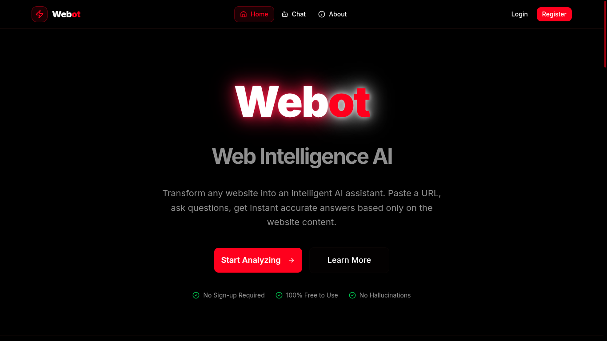
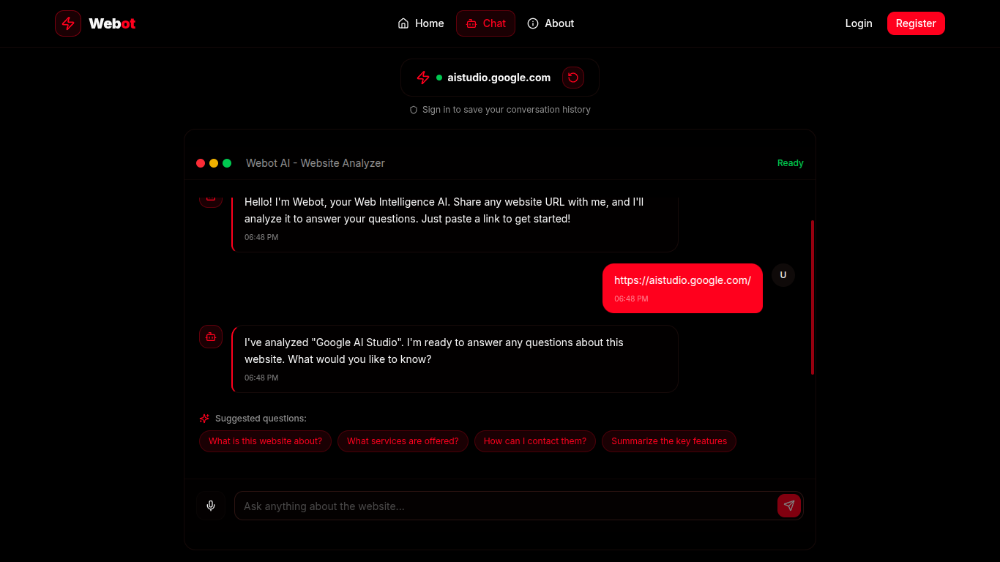
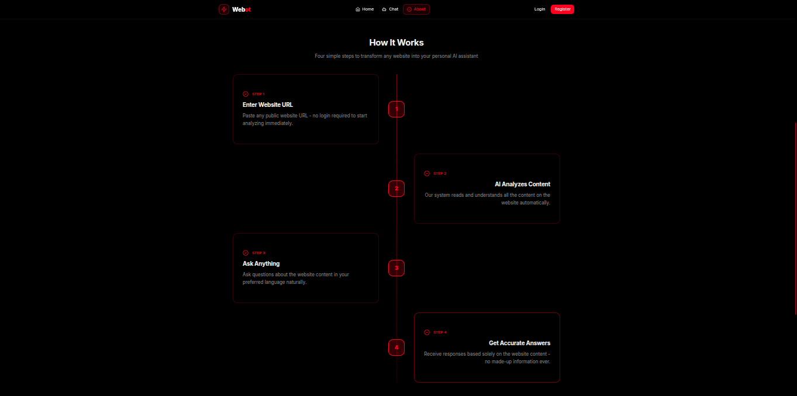

#  Webot – Website Intelligence AI

 Webot is an AI-powered website intelligence chatbot that converts any public website into an interactive question-answering assistant.  
 By simply providing a website URL, Webot analyzes the content and allows users to ask questions and receive accurate, easy-to-understand answers.

---

##  Features

-  Analyze any public website using its URL  
-  AI-powered chatbot for instant responses  
-  Deep content understanding and retrieval  
-  Clean and interactive user interface  
-  User login system to store chat history  
-  Fast and intelligent responses using AI models  

---

##  Screenshots

### Homepage
<p align="left">
  
</p>

### Chat Interface
<p align="left">
  
</p>

### Working Procedure
<p align="left">
  
</p>

---

## 🛠️ Tech Stack

**Frontend**
- React  
- TypeScript  
- Tailwind CSS  

**Backend**
- Node.js  
- API Routes  

**AI Integration**
- Google Gemini API  

---

## 📂 Project Structure
```

Webot.
├── app
│   ├── about
│   │   └── page.tsx
│   ├── api
│   │   ├── chat
│   │   │   └── route.ts
│   │   └── scrape-website
│   │       └── route.ts
│   ├── chat
│   │   ├── loading.tsx
│   │   └── page.tsx
│   ├── globals.css
│   ├── history
│   │   └── page.tsx
│   ├── layout.tsx
│   ├── login
│   │   └── page.tsx
│   ├── not-found.tsx
│   ├── page.tsx
│   └── register
│       └── page.tsx
├── components
│   ├── auth
│   │   └── auth-form.tsx
│   ├── chat
│   │   ├── chat-history-list.tsx
│   │   └── chat-interface.tsx
│   ├── layout
│   │   ├── navbar.tsx
│   │   └── page-wrapper.tsx
│   ├── theme-provider.tsx
│   └── ui
│       ├── accordion.tsx
│       ├── alert-dialog.tsx
│       ├── alert.tsx
│       ├── aspect-ratio.tsx
│       ├── avatar.tsx
│       ├── badge.tsx
│       ├── breadcrumb.tsx
│       ├── button-group.tsx
│       ├── button.tsx
│       ├── calendar.tsx
│       ├── card.tsx
│       ├── carousel.tsx
│       ├── chart.tsx
│       ├── checkbox.tsx
│       ├── collapsible.tsx
│       ├── command.tsx
│       ├── context-menu.tsx
│       ├── dialog.tsx
│       ├── drawer.tsx
│       ├── dropdown-menu.tsx
│       ├── empty.tsx
│       ├── field.tsx
│       ├── form.tsx
│       ├── hover-card.tsx
│       ├── input-group.tsx
│       ├── input-otp.tsx
│       ├── input.tsx
│       ├── item.tsx
│       ├── kbd.tsx
│       ├── label.tsx
│       ├── menubar.tsx
│       ├── navigation-menu.tsx
│       ├── pagination.tsx
│       ├── popover.tsx
│       ├── progress.tsx
│       ├── radio-group.tsx
│       ├── resizable.tsx
│       ├── scroll-area.tsx
│       ├── select.tsx
│       ├── separator.tsx
│       ├── sheet.tsx
│       ├── sidebar.tsx
│       ├── skeleton.tsx
│       ├── slider.tsx
│       ├── sonner.tsx
│       ├── spinner.tsx
│       ├── switch.tsx
│       ├── table.tsx
│       ├── tabs.tsx
│       ├── textarea.tsx
│       ├── toaster.tsx
│       ├── toast.tsx
│       ├── toggle-group.tsx
│       ├── toggle.tsx
│       ├── tooltip.tsx
│       ├── use-mobile.tsx
│       └── use-toast.ts
├── components.json
├── contexts
│   ├── auth-context.tsx
│   └── language-context.tsx
├── hooks
│   ├── use-mobile.ts
│   └── use-toast.ts
├── lib
│   ├── firebase.ts
│   ├── firestore.ts
│   └── utils.ts
├── next.config.mjs
├── package.json
├── pnpm-lock.yaml
├── postcss.config.mjs
├── public
│   ├── apple-icon.png
│   ├── icon-dark-32x32.png
│   ├── icon-light-32x32.png
│   ├── icon.svg
│   ├── placeholder.jpg
│   ├── placeholder-logo.png
│   ├── placeholder-logo.svg
│   ├── placeholder.svg
│   └── placeholder-user.jpg
├── README.md
├── scripts
│   └── flask_backend
│       ├── app.py
│       ├── embeddings.py
│       ├── gunicorn_config.py
│       ├── rag_chat.py
│       ├── README.md
│       ├── requirements.txt
│       └── scraper.py
├── styles
│   └── globals.css
└── tsconfig.json


```

---

Installation & Setup

 1️⃣ Clone the repository
```
git clone https://github.com/Mohan8877/Webot.git
```
2️⃣ Navigate to the project folder
```
cd Webot
```
3️⃣ Install dependencies
```
npm install
```
4️⃣ Run the development server
```
npm run dev
```
5️⃣ Open in browser
```
http://localhost:3000
```
---
Environment Variables:

Create a .env file in the root directory and add:
```
      GEMINI_API_KEY=your_gemini_api_key_here
```
---
 Project Status:
 
   Under Active Development
  This project is currently being improved with new features and optimizations.
    
---

 Future Enhancements:

   - Multi-language chatbot support
   - Advanced RAG (Retrieval-Augmented Generation)
   - User chat analytics dashboard
   - Improved UI animations
   - Cloud deployment
 ---
 
 Author:
 
     Mohan-B.Tech Student RGUKT-RKV

  
---

 GitHub:
 ``` 
 
 https://github.com/Mohan8877
 
 ```
---

 Support & Contribution:
 
    If you like this project:
           -Star the repository
           -Fork it
           -Share feedback or suggestions
---
Contributions are always welcome!


